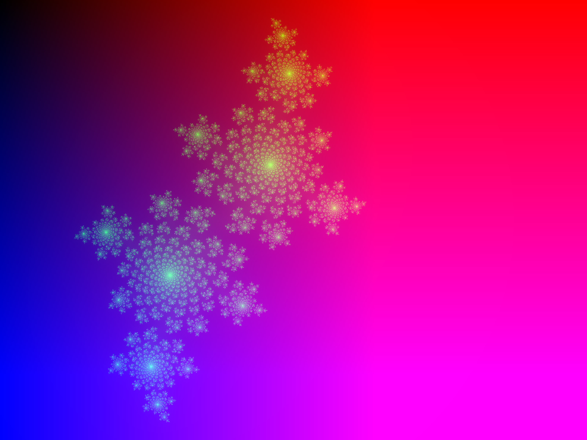

# made with &#x2661;, written in Rust

## julia fractal
```rust
let mut i = 0;
while i < 255 && z.norm() <= 2 {
    z = z * z + c;
    i += 1;
}
```



```rust
let mut i = 0;
while i < 255 && z.norm() <= 1.1 {
    z = z * z + c;
    i += 1;
}
```


```rust
let columns = 1500;
let rows = 1500;

let k_cols = 3.0 / columns as f32;
let k_rows = 3.0 / rows as f32;
```
